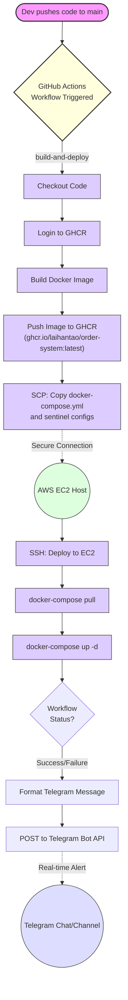
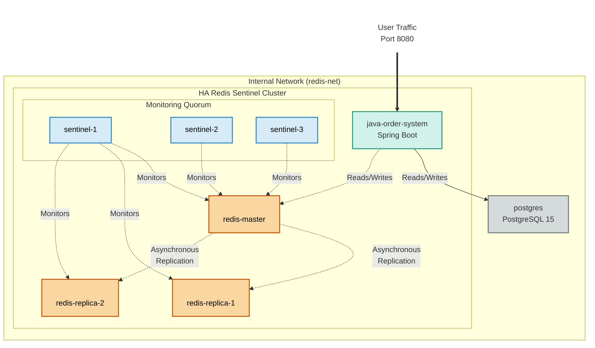

# 🛒 High-Availability Order System (Redis Idempotency & Sentinel HA)

## 📌 Project Overview
This project demonstrates a production-grade backend architecture designed to solve high-concurrency challenges in order management. It specifically focuses on Race Condition Mitigation, Idempotency, and Infrastructure Resilience using a Java/Spring Boot core and a self-healing Redis cluster.

## 🧰 Tech Stack: 
- Java 17, Spring Boot
- MyBatis (Order/Logging Mappers)
- Database: PostgreSQL 15
- Caching & HA: Redis 7 (Master-Replica Configuration)
- Orchestration: Redis Sentinel (3-node Quorum)
- Environment: Docker & Docker Compose

## 🏗️ System Logic & Workflow
The system handles order creation with a focus on data integrity and external service integration.

### Core Order Logic (createOrder)
- Unique Identity: Generates a UUID based Order ID to ensure global uniqueness.
- External Integration: Communicates with foodServices to validate item existence and fetch real-time pricing.
- Fault Tolerance: If a specific food item is not found (404), the system gracefully skips the item rather than failing the entire transaction.
- Persistent Logging: Every failure is captured via loggingMapper into the database, including the Order ID and error details for production debugging.

## Implementation Strategies
| Approach | Mechanism | Client Experience |
|------|--------|--------|
| Standard (DB Only) | Direct INSERT to Postgres | Risk of duplicate orders and high DB load during spikes |
| Redis Optimized | SETNX Distributed Locking + Idempotency Keys | Guaranteed single execution; redundant requests receive cached results |


## 🛡️ Infrastructure: Redis Sentinel High Availability

To prevent the "Single Point of Failure" common in standard cache setups, this project implements Redis Sentinel.

#### Sentinel vs. Single Node

| Feature | Single Node Redis | Redis Sentinel (HA) |
|------|--------|--------|
| Failure Domain | Entire service outage | Isolated node degradation |
| Recovery | Manual intervention | Automatic promotion via Leader Election |
| Awareness | Blind to topology | Continuous distributed monitoring |

#### The Failover & Quorum Theory
A 3-node Sentinel deployment is used to reach a Quorum.
- **SDOWN**: One sentinel perceives the master is down.
- **ODOWN**: The Quorum (majority) agrees the master is down, triggering a Leader Election.
- **Promotion**: The Sentinel leader promotes the healthiest replica to Master, ensuring the Java app can continue processing orders with minimal downtime.

## 🔐 Idempotency Design
The system protects against "Double Tap" (duplicate) requests using a two-tier defense:

1. Redis Layer (The Shield):
- Lock Key: IDEMPOTENCY:LOCK:USERID:{userId}:{key}
- Result Cache: IDEMPOTENCY:RESULT:USERID:{userId}:{key}
- Result: Returns 409 Conflict if processing is in progress, or the cached OrderResponseDTO if already completed.

2. Database Layer (The Anchor):
- Uses a UNIQUE(user_id, idempotency_key) constraint.
- Result: Ensures that even if the Redis lock expires prematurely, the DB remains the final source of truth.

## 📦 Docker Setup Breakdown
The environment is orchestrated via docker-compose.yml:
- App: The Java order system.
- Postgres: Primary relational storage.
- Redis Master/Replicas: 1 Master and 2 Replicas to handle read/write splitting.
- Sentinels (x3): Three separate sentinel containers for resilient monitoring.

## 🏗 Architecture Overview
This project utilizes a modern containerized workflow managed by a fully automated CI/CD pipeline and highly available system infrastructure.

### 🔄 CI/CD Pipeline (GitHub Actions)
The pipeline automates the entire lifecycle from commit to deployment, ensuring consistency and visibility.



### 🌐 System Infrastructure (Docker Compose)
The production environment on EC2 is composed of eight containers networked for security and performance. This setup guarantees persistence and high availability.



## 🧪 Testing Scenarios

#### Scenario 1: High Concurrency (No Redis)
- Load: 500 concurrent threads.
- Result: Race conditions detected. Duplicate database insert attempts lead to inconsistent order states and increased latency.

#### Scenario 2: High Concurrency (With Redis Sentinel)
- Load: 500 concurrent threads.
- Result: Redis locks successfully intercept duplicate requests. Database pressure is significantly reduced, and the system maintains a 100% idempotency rate.Failover Test: Manually stopping the Redis Master container results in an automatic failover; the system resumes order processing within seconds.

## 🗺️ Future Roadmap
This project has achieved its primary goal of demonstrating a high-availability order system. To evolve this into a production-grade enterprise solution, the following enhancements are planned:

### 🏗️ Infrastructure & Automation
| Feature | Objective | Impact |
| ------ | ------ | ------|
| Terraform (IaC) | Infrastructure as Code | Eliminate manual AWS Console configurations. Achieve "one-command" environment provisioning to ensure parity between Dev, Staging, and Prod. Also ensure the consistency between server.| 
| Blue-Green Deployment | Zero-Downtime Updates | Implement a pipeline that spins up a new environment (Green) alongside the old one (Blue), switching traffic only after health checks pass to ensure 100% availability. |
| Prometheus & Grafana | Observability | Real-time monitoring of system metrics (CPU, RAM, JVM heap) and Redis Sentinel health status with visual dashboards.|
| Database Migration | Schema Versioning | Automate table initialization and schema updates. Replaces manual SQL scripts with version-controlled migration files that execute automatically during application startup.|

### 🛡️ System Resilience & Monitoring
| Feature | Objective | Impact |
| ------ | ------ | ------ |
| Sentinel Webhooks | Real-time Incident Alerts | Integrate Redis Sentinel events with Telegram/Slack. Automatically notify the engineering team immediately when a master-slave failover occurs.|
| Chaos Engineering | Fault Tolerance Testing | Implement tools like Chaos Monkey to randomly terminate Redis nodes or DB instances in a staging environment to verify the system's self-healing capabilities. |

### 💻 Application & Business Logic
To further develop the ordering system to make it more robust (Full cycle of ordering system)

| Feature | Objective | Impact |
| ------ | ------ | ------ |
| Multi-Tenancy | Business Scalability | Update the database schema and application logic to support multiple vendors/restaurants within the same infrastructure. |
| Advanced Rate Limiting | System Protection | Implement Redis-based sidecar rate limiting (Token Bucket) to protect the backend from burst traffic and potential DDoS attacks. |

## 🚀 How to Run 

### Local
1. Clone the Repo

2. Docker compose
> docker-compose up --build

3. Create necessary table in your postgres, refer to ./setup/sql_README.md
> This part can be automated in Docker Compose, by simply mount this file to /docker-entrypoint-initdb.d/ under postgres service.

4. Proceed API call for testing
> http://localhost:8080/orders/createWithRedis

Sample payload
```json
{
  "userId": 1,
  "items": [
    {
      "foodId": 1,
      "quantity": 2
    },
    {
      "foodId": 2,
      "quantity": 7
    }
  ],
  "idempotencyKey": "TEST_KEY_1"
}
```

### Deploy in EC2 with CI/CD (Github action)
---
#### Setup Github 

1. Add github secret in Github Repository environment variable
    - EC2_HOST
    - EC2_USER
    - EC2_SSH_KEY (Refer to step Setup AWS EC2 Server - Step 7)
    - EC2_PROJECT_PATH

2. If you want to integrate with telegram bot as well: (If not, remove the telegram part from docker-compose.yml to prevent github workflow error.)
    - TELEGRAM_BOT_TOKEN
    - TELEGRRAM_CHAT_ID

---
#### Setup AWS EC2 Server 

1. Create EC2 Server
2. Setup the security and allow the port

    - Postgres: 5432
    - Java: 8080
    - HTTP: 80
    - HTTPS: 443
    - SSH: 22

    > Only open port 80/443 to the world. Ports 5432 and 6379 should only be accessible internally or from your specific IP.

4. Access to the EC2 server with AWS Console (Or with Winscp, then you need setup the key pair to access)
5. Create ssh key for CI/CD usage.
    ```
    ssh-keygen -t ed25519 -C "github-deploy"
    ```
    ```
    chmod 600 ~/.ssh/authorized_keys
    ```

6. Go to /home/ec2-user/.ssh and copy your private key.
7. Paste in github secret `EC2_SSH_KEY`
---
#### Install docker in EC2

1. Install Docker (daemon + CLI)
    
    1.1 Install docker  
      ```
      sudo dnf install -y docker
      ```

    1.2 Enable system control for docker
      ```
      sudo systemctl enable --now docker
      ```

    1.3 Check docker version to ensure it is installed in your EC2.
      ```
      docker --version
      ```

    1.4 Make sure the docker service is running.
      ```
      sudo systemctl status docker
      ```
    --- 
2. Install Docker Compose CLI (docker-compose)

    2.1 Install docker compose
      ```
      sudo curl -L "https://github.com/docker/compose/releases/download/v2.29.1/docker-compose-$(uname -s)-$(uname -m)" \ -o /usr/local/bin/docker-compose
      ```
    
    2.2 Grant access
      ```
      sudo chmod +x /usr/local/bin/docker-compose
      ```
    
    2.3 Check if docker-compose installed correctly
      ```
      docker-compose version
      ```
    ---
3. Grant permission to Docker

    3.1 Give access
      ```
      sudo usermod -a -G docker ec2-user
      ```
    
    3.2 Refresh your docker session
      ```
      newgrp docker
      ```
    
    3.3 Check if you able to list docker container, if yes, then setup is completed.
      ```
      docker ps
      ```
---
#### Create folder directory 
> /var/www/HTLAI/order-system

> sudo mkdir -p /var/www/HTLAI/order-system

Grant access
> sudo chown -R ec2-user:ec2-user /var/www/HTLAI/order-system
---
#### Put necessary file to the directory
1. Grant access to your current user if you're using winscp.
> sudo chmod -R 777 /var/www/HTLAI/order-system/redis-sentinel

2. Proceed upload file
- In `/var/www/HTLAI/order-system`, put file `docker-compose.yml`.
- In `/var/www/HTLAI/order-system/redis-sentinel`, put file `sentinel.conf`.
- In `/var/www/HTLAI/order-system/redis-sentinel/s1`, put file `sentinel.conf`.
- In `/var/www/HTLAI/order-system/redis-sentinel/s2`, put file `sentinel.conf`.
- In `/var/www/HTLAI/order-system/redis-sentinel/s3`, put file `sentinel.conf`.
---
#### Can proceed start project with `docker-compose up -d` or trigger the workflow in github. 


# Project Planning & Tracker:

| ✅ Completed/ Implemented | ⏳ In Planning | 🚧 In Development | 

## Phrase 1:
- ✅Docker
  - ✅Java
  - ✅Redis
    - ✅Redis Sentinel
  - ⏳Kafka
  - ⏳Prometheus
  - ⏳Grafana

**Java**
- ⏳Order module 
- ⏳Food module 
- ⏳Order details module 
- ⏳Payment module 

**Redis**
- ✅Idempotency
  - 1st layer: LOCKED KEY (user_id + idempotency_key), LOCKED VALUE (user_id + Java threadId)
  - 2nd layer: Database constraint (user_id, idempotency_key)
- ✅Cached data

**Redis Sentinel**
- ✅3 Quorum
- ✅Resilence failover

**Prometheus**
- ⏳Get data source from server
- ⏳Get data source from database

**Grafana**
- ⏳Monitoring on server based on Prometheus
- ⏳Monitoring on database based on Prometheus

**Kafka**
- ⏳Shock absorb
- ⏳Decouple service