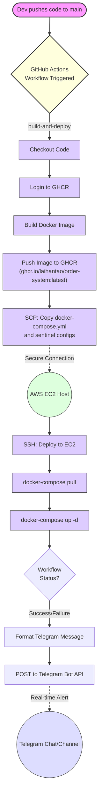
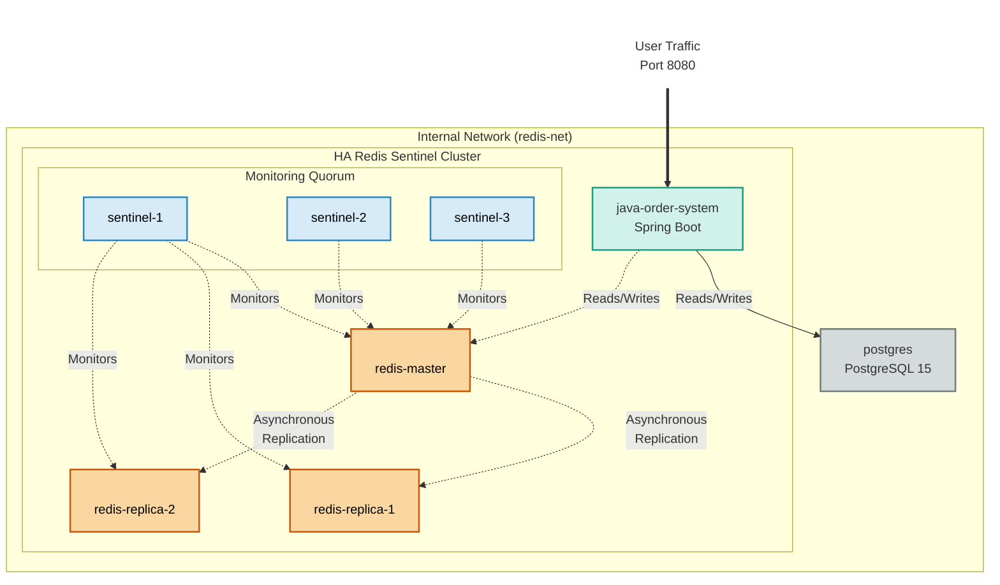

```mermaid
graph TD
    %% Workflow Triggers
    A([Dev pushes code to main]) --> B{GitHub Actions<br/>Workflow Triggered}
    B -- "build-and-deploy" --> C[Checkout Code]

    %% GHCR Interaction
    C --> D[Login to GHCR]
    D --> E[Build Docker Image]
    E --> F["Push Image to GHCR<br/>(ghcr.io/laihantao/order-system:latest)"]

    %% EC2 Interaction
    F --> G[SCP: Copy docker-compose.yml<br/>and sentinel configs]
    G -. Secure Connection .-> H((AWS EC2 Host))
    H --> I[SSH: Deploy to EC2]
    I --> J[docker-compose pull]
    J --> K[docker-compose up -d]

    %% Notifications
    K --> L{Workflow<br/>Status?}
    L -- Success/Failure --> M[Format Telegram Message]
    M --> N[POST to Telegram Bot API]
    N -. Real-time Alert .-> O((Telegram Chat/Channel))

    %% Stylings
    style A fill:#f9f,stroke:#333,stroke-width:2px
    style B fill:#ffd,stroke:#333,stroke-width:2px
    style C fill:#dcf,stroke:#333
    style D fill:#dcf,stroke:#333
    style E fill:#dcf,stroke:#333
    style F fill:#dcf,stroke:#333
    style G fill:#dcf,stroke:#333
    style I fill:#dcf,stroke:#333
    style J fill:#dcf,stroke:#333
    style K fill:#dcf,stroke:#333
    style H fill:#dfd,stroke:#333
    style O fill:#ddf,stroke:#333
```

```mermaid
graph TD
    %% User Access
    User[<br>User Traffic<br>Port 8080<br>] ==> App_Server

    %% Subgraph: Internal Bridge Network
    subgraph "Internal Network (redis-net)"
        direction TB

        %% Core Application and Database
        App_Server[java-order-system<br>Spring Boot]
        DB[postgres<br>PostgreSQL 15]

        %% Connectivity: App to DB
        App_Server -->|Reads/Writes| DB

        %% Subgraph: High Availability Cache (Redis)
        subgraph "HA Redis Sentinel Cluster"
            direction TB
            Master[<br>redis-master<br>]
            Replica1[<br>redis-replica-1<br>]
            Replica2[<br>redis-replica-2<br>]

            %% Connectivity: App to Cache
            App_Server -. Reads/Writes .-> Master
            Master -.->|Asynchronous<br>Replication| Replica1
            Master -.->|Asynchronous<br>Replication| Replica2

            %% Sentinel Monitoring Node (3rd node required for quorum)
            subgraph "Monitoring Quorum"
                S1[sentinel-1]
                S2[sentinel-2]
                S3[sentinel-3]
            end

            %% Monitoring connections
            S1 -.->|Monitors| Master
            S2 -.->|Monitors| Master
            S3 -.->|Monitors| Master
            S1 -.->|Monitors| Replica1
            S1 -.->|Monitors| Replica2
        end
    end

    %% Legend/Component Descriptions
    style App_Server fill:#d1f2eb,stroke:#16a085,stroke-width:2px
    style DB fill:#d5dbdb,stroke:#707b7c,stroke-width:2px
    style Master fill:#fad7a0,stroke:#d35400,stroke-width:2px,color:black
    style Replica1 fill:#fad7a0,stroke:#d35400,stroke-width:2px,color:black
    style Replica2 fill:#fad7a0,stroke:#d35400,stroke-width:2px,color:black
    style S1 fill:#d6eaf8,stroke:#2e86c1,stroke-width:2px,color:black
    style S2 fill:#d6eaf8,stroke:#2e86c1,stroke-width:2px,color:black
    style S3 fill:#d6eaf8,stroke:#2e86c1,stroke-width:2px,color:black
    style User fill:#fff,stroke:#fff

```